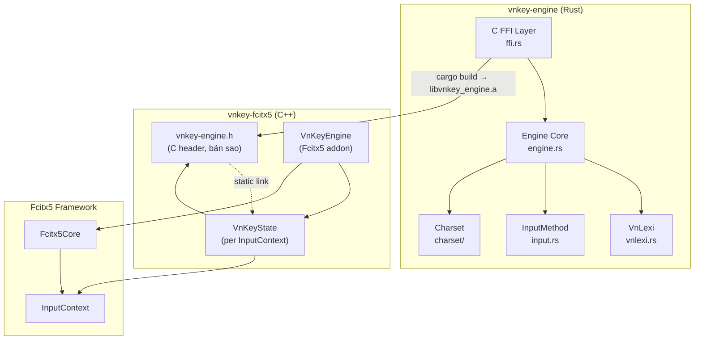
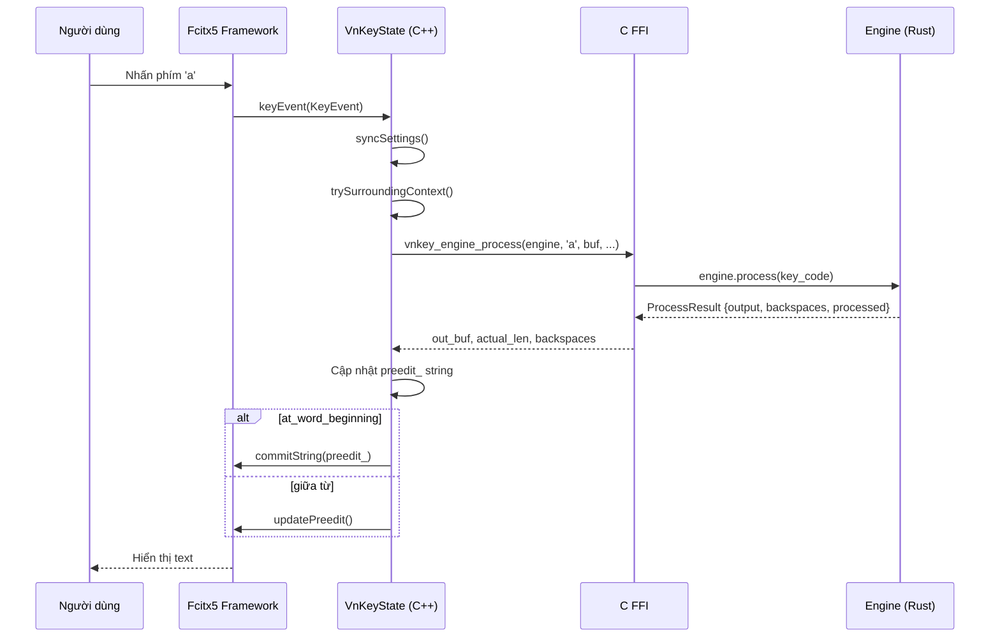

# Phân tích mối quan hệ: `vnkey-engine` ↔ `vnkey-fcitx5`

## Tóm tắt

**`vnkey-engine`** là **core engine** (Rust), xử lý logic gõ tiếng Việt. **`vnkey-fcitx5`** là **frontend/adapter** (C++), tích hợp engine vào framework Fcitx5 trên Linux. Quan hệ giữa chúng là **thư viện ↔ consumer** thông qua C FFI.

## Cơ chế kết nối

### 1. Build dependency (compile-time)

| Bước | Chi tiết |
|------|---------|
| **1** | `vnkey-engine` được build bằng `cargo build --release` → tạo ra `libvnkey_engine.a` (static library) |
| **2** | `vnkey-fcitx5/CMakeLists.txt` trỏ tới thư mục `../vnkey-engine/target/release/` để tìm file `.a` |
| **3** | File `vnkey-fcitx5/src/vnkey-engine.h` khai báo C FFI functions tương ứng với `vnkey-engine/src/ffi.rs` |
| **4** | `vnkey-fcitx5.cpp` `#include "vnkey-engine.h"` và gọi các hàm FFI |
| **5** | CMake link static: `target_link_libraries(vnkey ... vnkey_engine ...)` |

> [!IMPORTANT]
> `vnkey-engine` **phải được build trước** `vnkey-fcitx5`. File `.a` được **link tĩnh** vào file `.so` của addon.

### 2. API Boundary (C FFI)

`vnkey-fcitx5` sử dụng **Instance API** (không phải Singleton API) từ engine:

| C FFI Function | Gọi trong `vnkey-fcitx5.cpp` | Mục đích |
|---|---|---|
| `vnkey_engine_new()` | [VnKeyState constructor](file:///home/lmo1720/Developer/vnkey/vnkey-fcitx5/src/vnkey-fcitx5.cpp#L294) | Tạo engine instance cho mỗi InputContext |
| `vnkey_engine_free()` | [VnKeyState destructor](file:///home/lmo1720/Developer/vnkey/vnkey-fcitx5/src/vnkey-fcitx5.cpp#L299) | Giải phóng engine |
| `vnkey_engine_process()` | [keyEvent](file:///home/lmo1720/Developer/vnkey/vnkey-fcitx5/src/vnkey-fcitx5.cpp#L700) | Xử lý phím gõ |
| `vnkey_engine_backspace()` | [keyEvent](file:///home/lmo1720/Developer/vnkey/vnkey-fcitx5/src/vnkey-fcitx5.cpp#L644) | Xử lý phím Backspace |
| `vnkey_engine_reset()` | [reset](file:///home/lmo1720/Developer/vnkey/vnkey-fcitx5/src/vnkey-fcitx5.cpp#L334) | Reset trạng thái |
| `vnkey_engine_soft_reset()` | [commitPreedit](file:///home/lmo1720/Developer/vnkey/vnkey-fcitx5/src/vnkey-fcitx5.cpp#L542) | Soft reset khi Space |
| `vnkey_engine_feed_context()` | [trySurroundingContext](file:///home/lmo1720/Developer/vnkey/vnkey-fcitx5/src/vnkey-fcitx5.cpp#L597) | Nạp surrounding text |
| `vnkey_engine_set_input_method()` | [syncSettings](file:///home/lmo1720/Developer/vnkey/vnkey-fcitx5/src/vnkey-fcitx5.cpp#L308) | Đặt kiểu gõ (Telex/VNI/...) |
| `vnkey_engine_set_viet_mode()` | [activate](file:///home/lmo1720/Developer/vnkey/vnkey-fcitx5/src/vnkey-fcitx5.cpp#L321) | Bật/tắt chế độ tiếng Việt |
| `vnkey_engine_set_options()` | [syncSettings](file:///home/lmo1720/Developer/vnkey/vnkey-fcitx5/src/vnkey-fcitx5.cpp#L312) | Thiết lập options |
| `vnkey_engine_at_word_beginning()` | [keyEvent](file:///home/lmo1720/Developer/vnkey/vnkey-fcitx5/src/vnkey-fcitx5.cpp#L732) | Kiểm tra ranh giới từ |
| `vnkey_charset_from_utf8()` | [commitPreedit](file:///home/lmo1720/Developer/vnkey/vnkey-fcitx5/src/vnkey-fcitx5.cpp#L514), [convertClipboard](file:///home/lmo1720/Developer/vnkey/vnkey-fcitx5/src/vnkey-fcitx5.cpp#L488) | Chuyển mã UTF-8 → legacy |
| `vnkey_charset_to_utf8()` | [convertClipboard](file:///home/lmo1720/Developer/vnkey/vnkey-fcitx5/src/vnkey-fcitx5.cpp#L466) | Chuyển mã legacy → UTF-8 |

### 3. Data Flow (khi người dùng gõ phím)

---

## Phần nào là "riêng" của từng module?

### ✅ Sửa **riêng** trong `vnkey-fcitx5` (KHÔNG ảnh hưởng engine)

| Phần | File | Mô tả |
|------|------|-------|
| Menu/UI | [vnkey-fcitx5.cpp:34-63](file:///home/lmo1720/Developer/vnkey/vnkey-fcitx5/src/vnkey-fcitx5.cpp#L34-L63) | Thêm/sửa menu items |
| Config lưu/đọc | [vnkey-fcitx5.cpp:66-114](file:///home/lmo1720/Developer/vnkey/vnkey-fcitx5/src/vnkey-fcitx5.cpp#L66-L114) | JSON config (`~/.config/vnkey/config.json`) |
| Preedit handling | [vnkey-fcitx5.cpp:504-545](file:///home/lmo1720/Developer/vnkey/vnkey-fcitx5/src/vnkey-fcitx5.cpp#L504-L545) | Cách hiển thị/commit preedit |
| Key routing | [vnkey-fcitx5.cpp:600-754](file:///home/lmo1720/Developer/vnkey/vnkey-fcitx5/src/vnkey-fcitx5.cpp#L600-L754) | Hotkey, modifier handling |
| Surrounding text | [vnkey-fcitx5.cpp:547-598](file:///home/lmo1720/Developer/vnkey/vnkey-fcitx5/src/vnkey-fcitx5.cpp#L547-L598) | Context recovery |
| Clipboard convert | [vnkey-fcitx5.cpp:412-502](file:///home/lmo1720/Developer/vnkey/vnkey-fcitx5/src/vnkey-fcitx5.cpp#L412-L502) | Chuyển mã clipboard |
| Charset encoding | [vnkey-fcitx5.cpp:343-410](file:///home/lmo1720/Developer/vnkey/vnkey-fcitx5/src/vnkey-fcitx5.cpp#L343-L410) | bytesToUtf8 / utf8ToBytes helpers |
| CPack packaging | [CMakeLists.txt:71-121](file:///home/lmo1720/Developer/vnkey/vnkey-fcitx5/CMakeLists.txt#L71-L121) | .deb / .rpm packaging |
| Addon descriptors | `data/` directory | `.conf` files, icon SVG |

### ✅ Sửa **riêng** trong `vnkey-engine` (KHÔNG ảnh hưởng fcitx5)

| Phần | File | Mô tả |
|------|------|-------|
| Logic xử lý phím | [engine.rs](file:///home/lmo1720/Developer/vnkey/vnkey-engine/src/engine.rs) | Core algorithm |
| Ngữ pháp tiếng Việt | [vnlexi.rs](file:///home/lmo1720/Developer/vnkey/vnkey-engine/src/vnlexi.rs) | Âm, vần, thanh |
| Bảng kiểu gõ | [input.rs](file:///home/lmo1720/Developer/vnkey/vnkey-engine/src/input.rs) | Telex/VNI/VIQR rules |
| Chuyển đổi bảng mã | [charset/](file:///home/lmo1720/Developer/vnkey/vnkey-engine/src/charset) | Encoding tables |
| Macro table | [macro_table.rs](file:///home/lmo1720/Developer/vnkey/vnkey-engine/src/macro_table.rs) | Text expansion |

### ⚠️ Sửa cần **đồng bộ cả hai**

| Thay đổi | Cần sửa ở engine | Cần sửa ở fcitx5 |
|----------|-------------------|-------------------|
| Thêm FFI function mới | `ffi.rs` | `vnkey-engine.h` + gọi trong `.cpp` |
| Thay đổi FFI signature | `ffi.rs` | `vnkey-engine.h` + cập nhật call sites |
| Thêm kiểu gõ mới | `input.rs` + `ffi.rs` | Menu items + `syncSettings()` |
| Thêm bảng mã mới | `charset/` + `ffi.rs` | Menu items + charset list |
| Thêm option mới | `lib.rs` (Options) + `ffi.rs` | Config load/save + menu + syncSettings |

---

## Kết luận

> [!TIP]
> **Nếu bạn muốn sửa "phần riêng" của mình:**
> - Sửa **UI/UX, menu, hotkey, preedit display, config format** → chỉ cần thay đổi trong `vnkey-fcitx5/src/vnkey-fcitx5.cpp` + `.h`
> - Sửa **logic gõ, spell check, charset** → chỉ cần thay đổi trong `vnkey-engine/src/`
> - **Không cần rebuild phía kia** miễn là không thay đổi FFI API (file `ffi.rs` / `vnkey-engine.h`)

Bạn muốn cập nhật phần nào cụ thể? Tôi có thể giúp xác định chính xác những file cần sửa.
